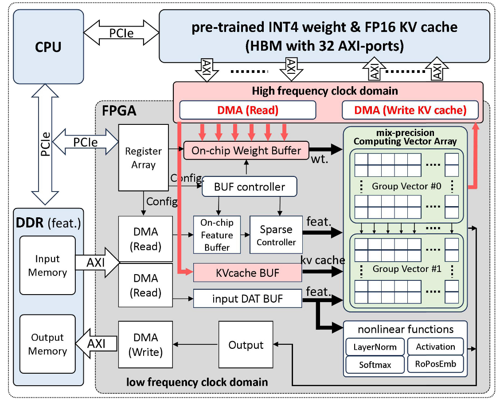
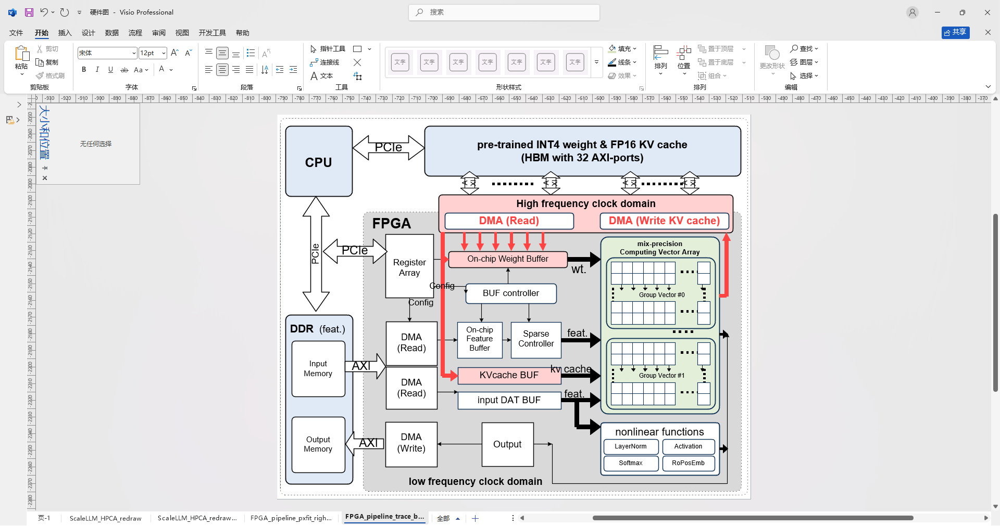
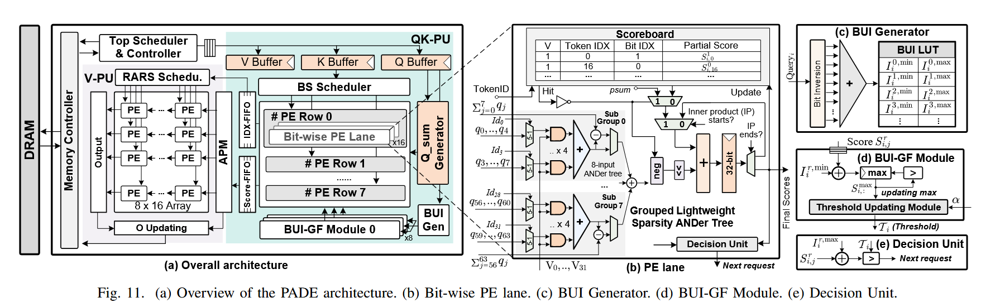
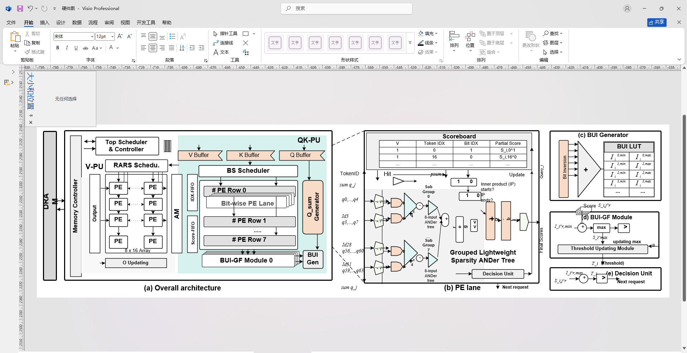
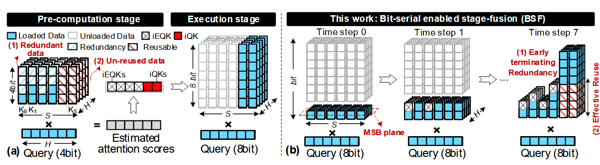
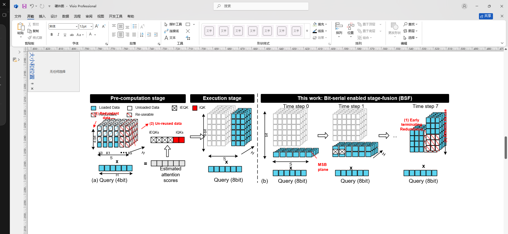

<p align="right">
  <a href="README.md">简体中文</a> | <strong>English</strong>
</p>

# Visio Copy

`visio-copy` is a Codex skill for recreating raster technical diagrams in Microsoft Visio as editable vector shapes, instead of simply pasting a screenshot.

It is designed for architecture figures, hardware block diagrams, dataflow diagrams, and paper-style module diagrams. The workflow uses Visio COM automation to draw rectangles, arrows, buses, tables, grids, formula labels, and stacked structures, then validates the result through exported previews and component-level crop comparisons.

## What This Skill Does

- Draws editable Visio shapes instead of raster-only copies.
- Uses source-image pixel coordinates as the shared coordinate system.
- Keeps a locked reference underlay during iteration, then removes it for final delivery.
- Provides a PowerShell scaffold for Visio COM drawing.
- Provides Python tools for color-region extraction and side-by-side crop comparison.
- Includes specialized guidance for stacked grids, key matrices, repeated small blocks, and dense tensor-like diagrams.

## Effect Showcase: Original vs Copy

The following examples show reference diagrams and `visio-copy` redraw results. The copy-side images are screenshots of editable Visio drawings, not pasted raster-only replacements.

**Version note:** this is the `1.0` release. Visio-copy works better for regular architecture and block diagrams than for very dense stacked tensor or repeated-cell diagrams. Dense stacks still require manual crop-level inspection and multiple repair passes, especially for small-cell separation, occlusion order, repeated-unit counts, hatch directions, and compact text layout.

| Case | Original | Copy |
| --- | --- | --- |
| Hardware architecture diagram |  |  |
| PADE architecture figure |  |  |
| Bit-serial stage-fusion figure |  |  |

## Repository Layout

```text
.
|-- README.md
|-- README.en.md
|-- SKILL.md
|-- assets/
|   `-- showcase/
|-- agents/
|-- references/
|   |-- redraw-checklist.md
|   `-- stacked-grid-mode.md
|-- scripts/
|   |-- crop_compare.py
|   |-- extract_color_components.py
|   |-- finalize_visio_copy_page.ps1
|   `-- visio_manual_redraw_scaffold.ps1
|-- requirements.txt
`-- LICENSE
```

## Requirements

- Windows
- Microsoft Visio desktop application
- PowerShell
- Python 3.10+
- Python packages in `requirements.txt`

Install Python dependencies:

```powershell
python -m pip install -r requirements.txt
```

## Install As A Codex Skill

Clone this repository into your Codex skills directory:

```powershell
git clone https://github.com/zwj276765037-lab/Visio-copy.git "$env:USERPROFILE\.codex\skills\visio-copy"
```

Then invoke it in Codex with:

```text
$visio-copy
```

## Basic Workflow

1. Prepare the target `.vsdx` file and reference image path.
2. Create a project-specific redraw script from `scripts/visio_manual_redraw_scaffold.ps1`.
3. Set the source image width, height, and pixel-to-Visio scale mapping.
4. Draw in pixel coordinates with helpers such as `Add-RectPx`, `Add-LinePx`, `Add-TextPx`, and `Add-PolygonPx`.
5. Export a preview PNG from Visio.
6. Generate matching component crops from the reference and preview images.
7. Repair geometry, text, arrows, line weights, layer order, and missing elements in batches.
8. After acceptance, clean the page by removing the tracing underlay and keeping only the final editable vector layer.

## Crop Comparison

Generate side-by-side validation crops:

```powershell
python scripts/crop_compare.py reference.png preview.png --out crops `
  --component left_stack:145,30,300,190 `
  --component right_table:560,40,220,120
```

Each component is defined as:

```text
name:x,y,w,h
```

Coordinates are in reference-image pixels.

## Color Component Extraction

Extract rough bounding boxes for common paper-figure color regions:

```powershell
python scripts/extract_color_components.py reference.png --min-area 100 --top 20
```

Use this only to seed coordinates. Final redraw quality still depends on manual component auditing and Visio shape-level drawing.

## Final Cleanup

After the user accepts the redraw:

```powershell
powershell -ExecutionPolicy Bypass -File scripts/finalize_visio_copy_page.ps1 `
  -TargetPath "path\to\diagram.vsdx" `
  -PageName "VisioCopy_Trace" `
  -FinalLayerName "ManualRedraw_HiRes"
```

This backs up the file, deletes shapes outside the final layer, removes temporary tracing layers, and saves the `.vsdx`.

## Notes For Dense Stacked Diagrams

Do not draw separated tensor/key-matrix blocks as one cuboid. Count the visible cells from crops, draw rear hints first, then draw opaque front cells so hidden rear lines do not pass through foreground gaps. Dense stacked diagrams must be validated at 2x or 3x crop scale.

See `references/stacked-grid-mode.md` for detailed rules.

## License

MIT License. See `LICENSE`.
