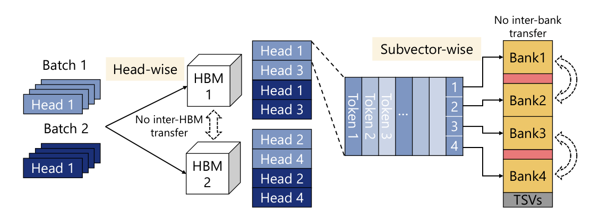
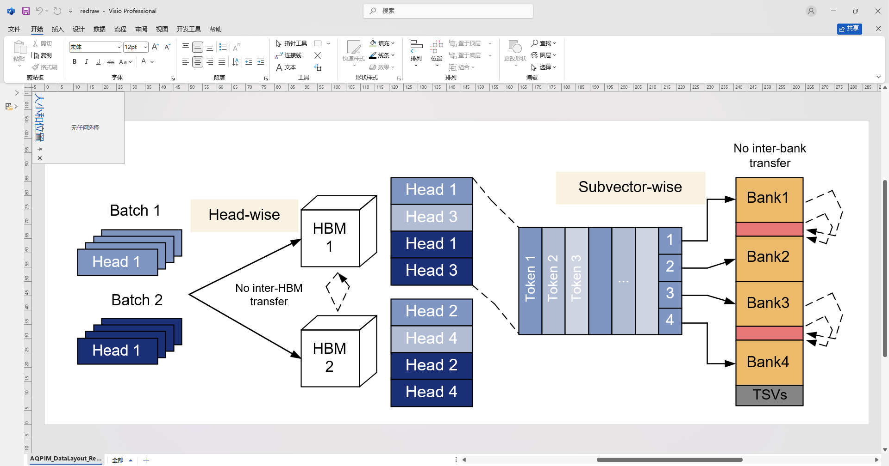
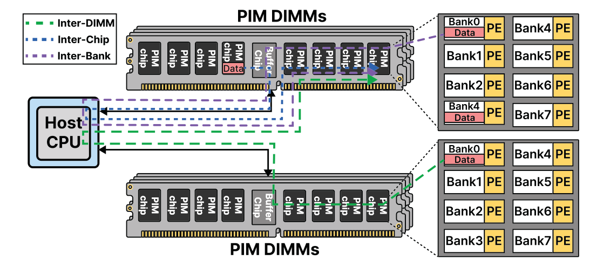
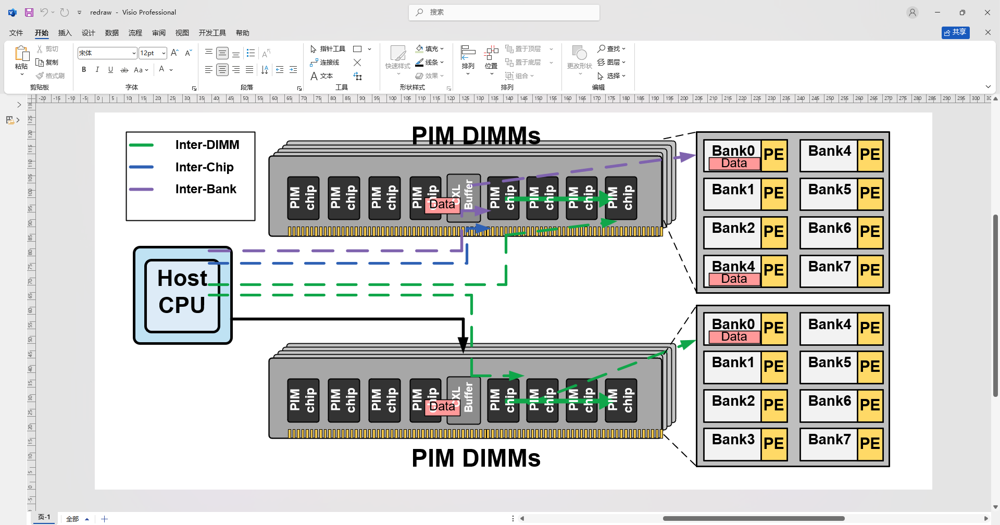
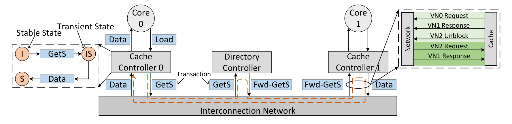
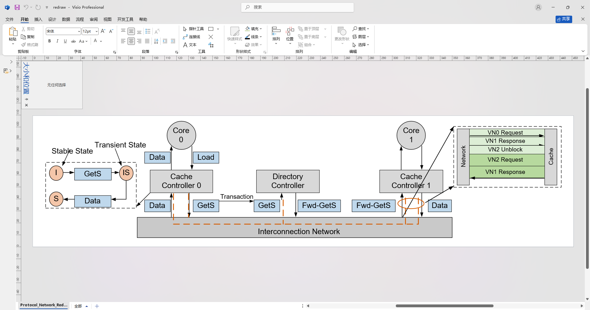
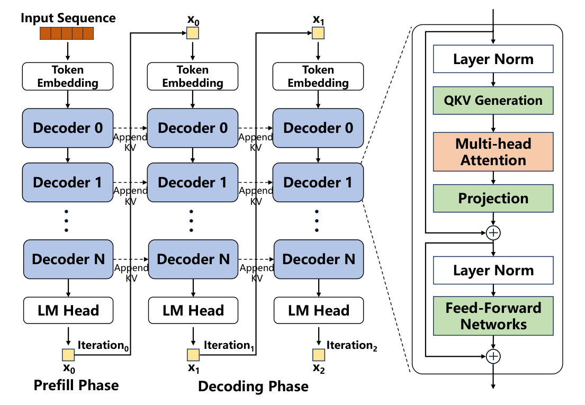
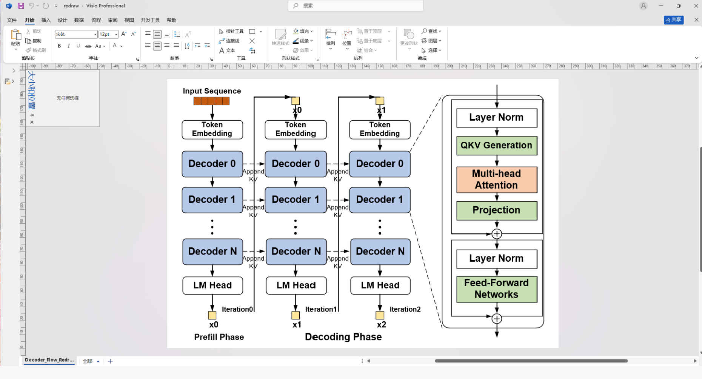
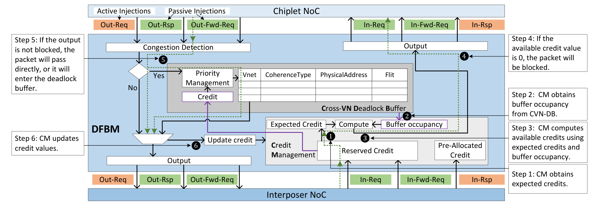
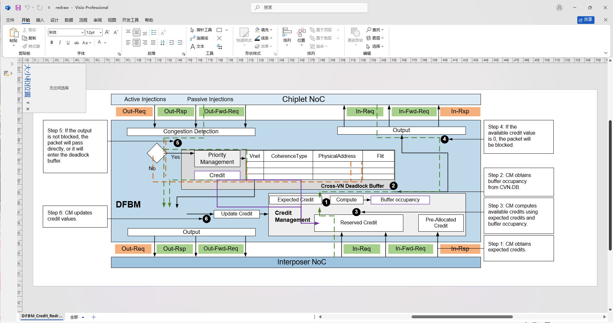

<p align="right">
  <strong>简体中文</strong> | <a href="README.en.md">English</a>
</p>

# Visio Copy

`visio-copy` 是一个 Codex skill，用于把论文、PPT、截图或其他 raster 技术图重画到 Microsoft Visio 中，并尽量生成可编辑的矢量 shapes，而不是简单粘贴一张图片。

它主要面向体系结构图、硬件模块图、数据流图、芯片/封装示意图、流程图、表格+架构混合图，以及论文中的复杂模块示意图。绘制过程使用 Visio COM 自动化创建矩形、箭头、总线、表格、网格、公式标签、堆叠结构和 2.5D/3D 形状，并通过导出的预览图和局部 crop 对比来检查质量。

使用建议：复杂线条、密集箭头、堆叠图形、3D/2.5D 示意图和大量重复小模块通常需要多轮修改才能达到更好的效果。使用时可以耐心多尝试几次；如果能单独指出错位、遮挡、箭头端点、层级顺序、文字换行或颜色不准等具体问题，`visio-copy` 通常能更快收敛到更好的可编辑 Visio 结果。

## 功能特点

- 生成可编辑的 Visio shapes，而不是 raster-only 截图替代品。
- 绘制动作发生在 Visio 中；最终 `.vsdx` 应由可编辑 shape、线条、文字和图层组成。
- 使用源图像像素坐标作为统一坐标系，便于精确放置模块、箭头和文字。
- 绘制过程只使用 Visio 原生 shape、connector、line、polygon、text、group 和 layer；参考图不作为 Visio 页面内容参与最终绘制。
- 提供 PowerShell Visio COM 绘图 scaffold 和通用 manual primitives。
- 提供 Python 工具用于颜色分析、颜色区域定位和局部 crop 对比。
- 支持常见硬件图元素：模块框、NoC/总线、表格、矩阵、小方块阵列、chiplet 网格、堆叠图、虚线区域、hatched 区域、粗箭头和局部标签。
- 强调文字透明绘制、局部坐标锚点、箭头端点避让、图层顺序和导出后文字换行检查。

## 2.0版本效果展示：原图 vs Copy

下面展示的是参考原图与 `visio-copy` 重画后的 Visio 结果。Copy 一侧是可编辑 Visio 图形的导出截图，不是直接贴图，也不是把参考图像临摹成不可编辑 raster。

**版本说明：** 这是 `2.0` 版本。相比 `1.0`，本版本重点提升了复杂硬件架构图的可编辑重画能力、局部排版稳定性、颜色/结构分析能力和 Visio 导出后的审计流程。`visio-copy` 仍然不是自动一键像素级复刻工具；高质量结果依旧依赖组件级检查和必要的人工修复，但 2.0 已经把很多常见失败模式固化为通用绘图规则和 reusable primitives。

| 案例 | 原图 | Copy |
| --- | --- | --- |
| AQPIM 数据布局 |  |  |
| PIM DIMMs 路由 |  |  |
| 协议网络示例 |  |  |
| Decoder Flow |  |  |
| DFBM Credit 管理 |  |  |

## 2.0 相比 1.0 的主要优化

- **更强的可编辑 Visio primitive：** 新增和强化了 `visio_copy_manual_primitives.ps1`，覆盖透明文字、fit 文字、圆角模块、表格、message-lane 表格、hatched 区域、polygon、orthogonal route、block arrow、isometric router grid、逻辑/电路符号等常用组件。
- **更稳定的文字排版：** 针对 Visio 导出 PNG 后短标签自动换行的问题，增加了 text lane、font cap、透明文本后绘制、旋转标签 bbox、分段彩色文本等规则。`PE`、`HBM`、`TSV`、`SRAM`、`NoC`、`P1`、`D1` 这类短标签不再只按肉眼宽度放置。
- **解决大白底遮挡问题：** 普通文字默认透明；只有在参考图本身存在 label knockout，或无法通过路由避让时，才允许使用极小范围 mask。禁止用大白底遮住灰块、bit bar、箭头、边框或底层网格。
- **内部小模块定位更可靠：** 强调父组件局部坐标和 helper-level anchors。大模块内部的小模块、bit bar、局部箭头、端口、表格 cell 和文字都应绑定父组件，而不是在全图坐标里手工漂移。
- **复杂硬件图规则更完整：** 增加了面向 chiplet/NoC、memory array、package/wafer/die/core 多视图、scheduling token chain、PE grid、dense table、stacked matrix、DIMM/board/package、DRAM/flash/storage controller 等图形的绘制准则。
- **更好的颜色与结构分析：** 新增 `analyze_reference_style.py`，可对整图和组件 crop 提取主色、局部颜色、边缘方向和结构提示，减少凭眼估色和估坐标。
- **更安全的 Visio 导出：** 新增 `export_visio_png_safe.ps1`，避免直接调用 Visio `Page.Export()` 时偶发卡死；同时强调使用页面背景 sentinel 和 off-page empty shape 清理来避免导出裁切异常。
- **更系统的局部审计：** 强化 `crop_compare.py` 和组件级 crop 对比流程。现在不只看整图是否“像”，还要求检查模块内部文字、箭头端点、图层遮挡、重复单元数量、cell pitch、线宽、颜色和 2.5D/3D 层级。
- **明确产物安全边界：** `redraw.vsdx` 保留给人工审阅后的最终可编辑 redraw。自动 scaffold、first-pass 或临时输出不应覆盖最终文件。

## 仓库结构

```text
.
|-- README.md
|-- README.en.md
|-- SKILL.md
|-- assets/
|   `-- showcase/
|-- agents/
|-- references/
|   |-- redraw-checklist.md
|   `-- stacked-grid-mode.md
|-- scripts/
|   |-- analyze_reference_style.py
|   |-- crop_compare.py
|   |-- export_visio_png_safe.ps1
|   |-- extract_color_components.py
|   |-- finalize_visio_copy_page.ps1
|   |-- import_visual_svg_to_visio.ps1
|   |-- raster_to_run_svg.py
|   |-- run_manual_crop_audit.ps1
|   |-- test_visio_copy_primitives_smoke.ps1
|   |-- visio_copy_manual_primitives.ps1
|   `-- visio_manual_redraw_scaffold.ps1
|-- requirements.txt
`-- LICENSE
```

## 环境要求

- Windows
- Microsoft Visio 桌面版
- PowerShell
- Python 3.10+
- `requirements.txt` 中的 Python 包

安装 Python 依赖：

```powershell
python -m pip install -r requirements.txt
```

## 安装为 Codex Skill

将本仓库 clone 到 Codex skills 目录，并保持目录名为 `visio-copy`：

```powershell
git clone https://github.com/zwj276765037-lab/Visio-copy.git "$env:USERPROFILE\.codex\skills\visio-copy"
```

然后在 Codex 中调用：

```text
$visio-copy
```

## 基本流程

1. 准备参考图片和目标 `.vsdx` 输出路径。
2. 使用 `scripts/visio_manual_redraw_scaffold.ps1` 或 `scripts/visio_copy_manual_primitives.ps1` 创建项目专用绘图脚本。
3. 设置源图像宽度、高度，以及像素到 Visio 页面坐标的映射。
4. 先绘制背景、外层模块和大区域，再绘制内部网格、端口、箭头、堆叠结构和局部细节。
5. 最后绘制文字。普通文字应默认透明，不应使用大白底遮挡线条、灰块、bit bar 或箭头。
6. 从 Visio 导出 `preview.png`，检查是否有裁切、缩放、文字换行、元素重叠或图层遮挡。
7. 对关键组件生成相同 bbox 的局部 crop，对比源图和预览图。
8. 批量修复几何位置、字体大小、文字框宽度、箭头端点、线宽、颜色、图层顺序和漏画元素。
9. 用户确认后，清理临时图层和非最终 shape，只保留最终可编辑矢量 redraw。

## 颜色与结构分析

在详细绘制前，可以先分析参考图的颜色、边缘方向和组件区域：

```powershell
python scripts/analyze_reference_style.py reference.png --top-colors 20 `
  --component main_panel:40,30,520,300 `
  --component legend:600,40,180,120
```

也可以提取常见颜色区域的粗略 bbox：

```powershell
python scripts/extract_color_components.py reference.png --min-area 100 --top 20
```

这些工具只用于辅助定位和采样。最终质量仍取决于组件级审计和 Visio shape 级绘制。

## 局部 Crop 对比

生成局部对比图：

```powershell
python scripts/crop_compare.py reference.png preview.png --out crops `
  --component left_stack:145,30,300,190 `
  --component right_table:560,40,220,120
```

组件格式：

```text
name:x,y,w,h
```

坐标均为参考图像中的像素坐标。即使 Visio 导出的 PNG 尺寸不同，`crop_compare.py` 也会按比例映射预览图 crop。

如果 redraw 目录中已经有 `manifest.json`，并在其中定义了 `audit_components`，可以直接运行：

```powershell
powershell -ExecutionPolicy Bypass -File scripts/run_manual_crop_audit.ps1 `
  -OutputDir "path\to\redraw-output" `
  -Zoom 3
```

该 wrapper 会读取 `source`、`preview` 和 `audit_components`，自动调用 `crop_compare.py` 生成 side-by-side、diff 和 metrics 文件。

## Visio PNG 安全导出

直接调用 Visio `Page.Export()` 有时会卡住。建议使用安全导出 wrapper：

```powershell
powershell -ExecutionPolicy Bypass -File scripts/export_visio_png_safe.ps1 `
  -VsdxPath "path\to\redraw.vsdx" `
  -PngPath "path\to\preview.png" `
  -TimeoutSeconds 90
```

## 最终清理

用户确认结果后，可以运行：

```powershell
powershell -ExecutionPolicy Bypass -File scripts/finalize_visio_copy_page.ps1 `
  -TargetPath "path\to\diagram.vsdx" `
  -PageName "VisioCopy_Trace" `
  -FinalLayerName "ManualRedraw_HiRes"
```

该脚本会备份文件，删除非最终层 shape，移除临时参考底图和临时图层，并保存 `.vsdx`。

## 禁用的 Trace 防线

仓库中保留了两个禁用型 guardrail 脚本：

- `scripts/raster_to_run_svg.py`
- `scripts/import_visual_svg_to_visio.ps1`

它们不是绘图流程的一部分，运行时会直接报错。保留它们的目的只是明确禁止 raster-to-SVG、SVG/PDF trace import 和自动像素矢量化路线，防止误把临摹/trace 当成 `visio-copy` 的正常交付方式。

## 绘制注意事项

- `redraw.vsdx` 应保留给人工审阅后的最终 Visio shape redraw；自动 first-pass、scaffold、截图、源图贴图或 raster trace 不应覆盖它。
- 最终文件中不应依赖参考底图作为可见内容；正常流程也不应把源图插入 Visio 页面当临摹底图。
- 大模块内部的小模块、文字、箭头和 bit bar 应使用父组件局部坐标定位，避免外框正确但内部错位。
- 普通文字默认透明。不要用大白底遮挡灰块、箭头、边框或底层网格。
- 短标签也需要足够宽的 text lane。`PE`、`HBM`、`TSV`、`SRAM`、`NoC`、`P1`、`D1` 等短词在 Visio 导出 PNG 后仍可能换行。
- 箭头端点应避让文字框。优先调整端点或路由，不要靠白底覆盖冲突。
- 粗箭头、空心箭头、chevron token、hatched 区域和 2.5D/3D 堆叠结构应使用专门 primitive 或显式 polygon，而不是简单加粗线条。
- 对密集堆叠图、key matrix、小方块阵列和复杂遮挡结构，必须使用 2x 或 3x 局部 crop 检查。

更多细节可参考：

- `references/redraw-checklist.md`
- `references/stacked-grid-mode.md`
- `SKILL.md`

## License

MIT License. See `LICENSE`.
